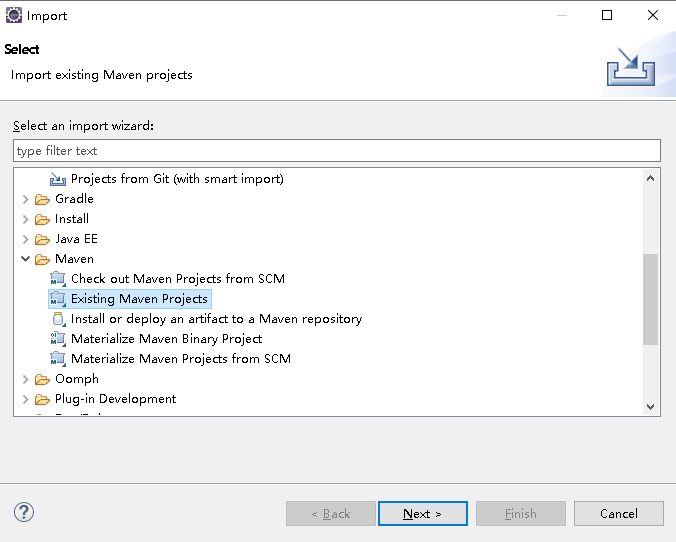
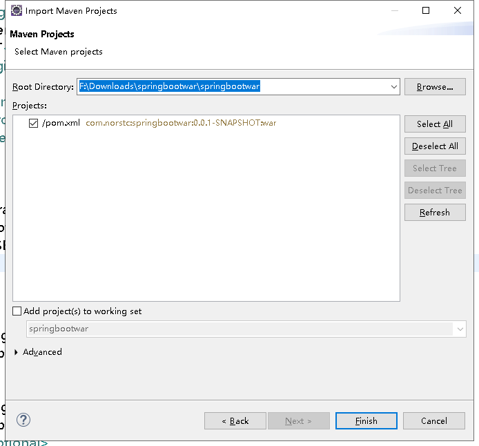

# springbootwar

使用springboot 打包war演示


# Spring-boot demo with war

## 准备项目

generate a project from https://start.spring.io/


注意这里选择的war


extract the zip file: springbootwar.zip


import this project to eclipse







## 修改代码

修改pom.xml中 增加jsp相关的依赖项

```xml
		    <!-- jsp的支持: springboot 内置的tomcat不支持jsp-->
        <dependency>
               <groupId>org.apache.tomcat.embed</groupId>
               <artifactId>tomcat-embed-jasper</artifactId>
               <scope>provided</scope>
        </dependency> 
		<dependency>
              <groupId>javax.servlet</groupId>
              <artifactId>javax.servlet-api</artifactId>
              
        </dependency>
        <dependency>
              <groupId>javax.servlet</groupId>
              <artifactId>jstl</artifactId>
            
        </dependency>
```


修改main 入口

```java
@SpringBootApplication
public class SpringbootwarApplication extends SpringBootServletInitializer{

	@Override
	protected SpringApplicationBuilder configure(SpringApplicationBuilder springbootwarApplication) {
		return springbootwarApplication.sources(SpringbootwarApplication.class);
	}
	public static void main(String[] args) {
		SpringApplication.run(SpringbootwarApplication.class, args);
	}

}
```


修改 application.properties

```properties
#jsp location
spring.mvc.view.prefix=/WEB-INF/jsp/
spring.mvc.view.suffix=.jsp

#more logs when debugging
logging.level.org.springframework=TRACE
logging.level.com=TRACE
```


添加第一个jsp代码

路径是webapp\WEB-INF\jsp\demo.jsp


```jsp
<%@ page language="java" contentType="text/html; charset=UTF-8"
    pageEncoding="UTF-8"%>
<%@ page import="java.util.*" %>
<!DOCTYPE html PUBLIC "-//W3C//DTD HTML 4.01 Transitional//EN" "http://www.w3.org/TR/html4/loose.dtd">
<html>
<head>
<title>Demo JSP</title>
</head>
<%-- JSP comments 这是一行注释 --%>
<%-- 注意下面这个感叹号，声明变量时必须要有，否则变量声明是无效的 --%>
<%! int demovar=0; %>

<body>
<% out.println("now is " + (new Date()).toString());  %>
 <br>
 
Count is:
<%-- 注意out里的o是小写的 --%>
<% out.println(demovar++); %>
<% out.println("your ip address is " + request.getRemoteAddr()); %>
<br>
<%-- 这里有一个提示异常，但是并不影响编译和运行 ，剪切再黏贴后就消失了。。。--%>
<% out.println("now is " + (new Date()).toString()); 
 %>
<br>
<body>
</html>
```


添加一个controller

src\main\java\com\norstc\springbootwar\controller\MainController.java


```java
@Controller
public class MainController {
	
	@RequestMapping("/hello")
	public String index() {
		return "hello war";
	}
	
	@RequestMapping("/hellojsp")
	public String helloJsp() {
		return "index";
	}
	
	@RequestMapping("/demojsp")
	public String demoJsp() {
		return "demo";
	}
}
```


## 使用github保存代码

https://github.com/norstc/springbootwar


## 本地验证

本地启动tomcat 8.5.57 (windows 64)


```batch
copy E:\tech\spring\SpringBoot\springbootwar\springbootwar\target\springbootwar-0.0.1-SNAPSHOT.war D:\apache-tomcat-8.5.57\webapps\ /Y
```


本地访问

<http://localhost:8080/springbootwar-0.0.1-SNAPSHOT/demojsp>


也可以直接 java -jar 运行编译出来的 war

```shell
java -jar E:\tech\spring\SpringBoot\springbootwar\springbootwar\target\springbootwar-0.0.1-SNAPSHOT.war
```

此时的访问地址不需要再加上应用名了
<http://localhost:8080/hellojsp>


## 使用jenkins部署

http://localhost:20201/job/springbootwar/

从github上拉代码，编译，打包，通过ssh上传到192.168.1.175，然后调用run.sh 部署到tomcat

## 访问效果

http://192.168.1.175:8099/springbootwar/hello

实际并没有执行jsp脚本，只是简单的过滤掉了=>是参考代码中有错，已经修正，可以执行了。
